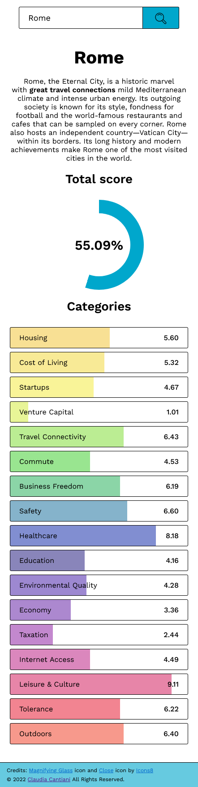
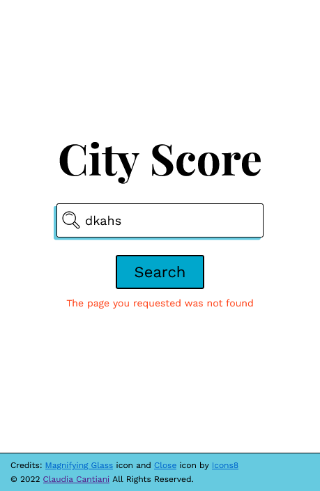
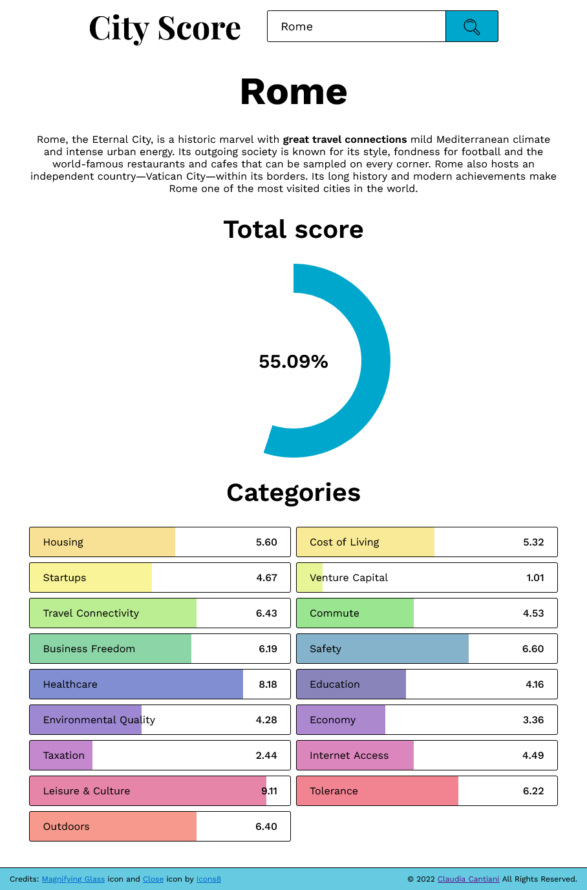
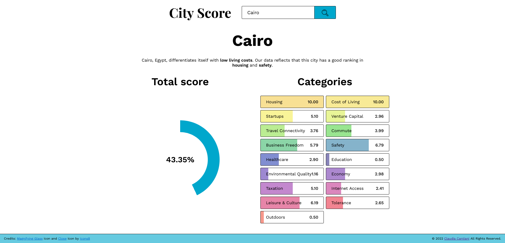

# City Score Application
[Live Site](https://cla91.github.io/city-score/)

This is a simple JavaScript application that lets the user view informations about the quality of life in a city, through the use of the external service [Teleport](https://api.teleport.org/api/urban_areas/slug:los-angeles/scores/).

## Table of contents

- [Overview](#overview)
  - [Requirements](#requirements)
  - [Added feature](#added-feature)
  - [Screenshot](#screenshot)
  - [Links](#links)
- [My process](#my-process)
  - [Built with](#built-with)
- [Contact](#contact)

## Overview

### Requirements

Requirements:

- simple textbox (Google style) to search for a city
- through the use of a button, the application should contact the external API Teleport to obtain the information about the searched city
- once the data has been received, the application will have to display the information regarding the categories, the description and the city score of the city on the page

### Added Feature

- the app shows a message error in case of: network connection error, page not found error and empty field error
- in the search box, while typing, a <datalist> HTML element gets added with javascript, with recommended options available, it also updates at every letter input
- for multiple search results: it shows a menu from which users can choose a single city

### Screenshot

### Links

- Live Site URL: [github pages](https://cla91.github.io/city-score/)
- Project Link - [github repository](https://github.com/cla91/city-score)

## My process

### Built with

- HTML5
- CSS3
- Vanilla JavaScript
- Webpack 5
- Lodash
- Axios

## Contact
- Claudia Cantiani - cclaudia0691@gmaill.com
- Sito web - [Claudia Cantiani | Front End Developer](https://cla91.github.io/)
- Frontend Mentor - [@cla91](https://www.frontendmentor.io/profile/cla91)
- GitHub - [https://github.com/cla91](https://github.com/cla91)
